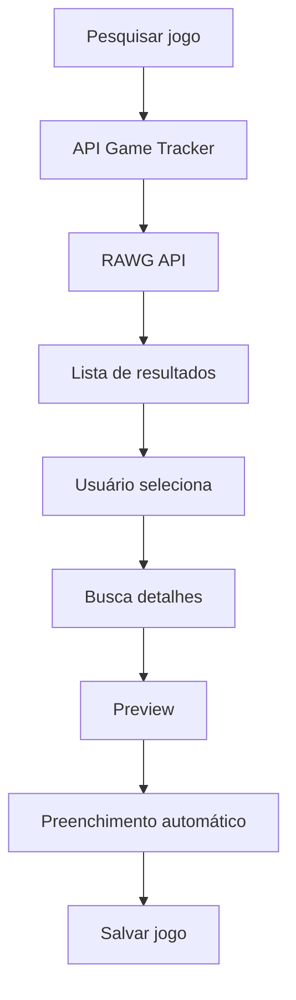

# 🎮 Game Tracker

O **Game Tracker** é uma aplicação web desenvolvida em **PHP** para gerenciar sua biblioteca de jogos. O projeto permite organizar sua coleção, acompanhar o progresso de cada jogo e visualizar estatísticas por meio de um dashboard.

Além da aplicação web, o projeto disponibiliza uma **API REST** protegida por autenticação JWT, utilizada pelo aplicativo **Game Tracker Mobile**.

O principal objetivo deste projeto foi aprofundar conhecimentos em desenvolvimento backend, arquitetura de software e boas práticas utilizando PHP puro, sem frameworks.

---

# ✨ Funcionalidades

### Aplicação Web

- ✅ Cadastro e autenticação de usuários
- ✅ CRUD completo de jogos
- ✅ Dashboard com estatísticas
- ✅ Seção de destaques
- ✅ Integração com a API RAWG
- ✅ Busca inteligente de jogos
- ✅ Seleção do jogo antes do cadastro
- ✅ Preenchimento automático dos dados
- ✅ Preview completo do jogo
- ✅ Organização dos jogos por status
- ✅ Validação de formulários
- ✅ Proteção contra CSRF
- ✅ Controle de acesso por usuário

### API REST

* ✅ Login com JWT
* ✅ Refresh Token
* ✅ Logout
* ✅ CRUD completo de jogos
* ✅ Proteção das rotas privadas
* ✅ Validação das requisições
* ✅ Controle de propriedade dos recursos (Ownership)

# 🌐 Integração com a RAWG API

Uma das principais funcionalidades do projeto é a integração com a API da RAWG, utilizada para enriquecer automaticamente os dados dos jogos cadastrados.

O fluxo funciona da seguinte forma:

```text
Usuário pesquisa um jogo
        ↓
API da aplicação
        ↓
RAWG API
        ↓
Lista de resultados
        ↓
Usuário seleciona o jogo
        ↓
Detalhes completos
        ↓
Formulário preenchido automaticamente
```

Com essa integração é possível obter automaticamente:

- 🎮 Título
- 🖼️ Capa
- ⭐ Nota
- 📅 Data de lançamento
- 🎯 Plataformas
- 🏷️ Gêneros

O identificador da RAWG também é armazenado na aplicação (`external_id`), permitindo futuras sincronizações e consultas sem depender do título do jogo.

## Fluxo de cadastro de jogos



---

# 🏗 Arquitetura

O projeto foi desenvolvido utilizando uma arquitetura inspirada no padrão **MVC**, com separação clara de responsabilidades.

```
app/
├── Controllers/
├── Core/
├── Helpers/
├── Middlewares/
├── Models/
├── Services/
└── Views/

config/
public/
routes/
tests/
```

A arquitetura do projeto separa claramente as responsabilidades entre as camadas da aplicação.

Os Services concentram regras de negócio e integrações externas, como a comunicação com a API da RAWG, enquanto Controllers, Models e Views permanecem desacoplados dessa lógica.

---

# 🛠 Tecnologias Utilizadas

* PHP 8
* MySQL
* PDO
* HTML5
* CSS3
* JavaScript (ES6+)
* Fetch API
* cURL
* API RAWG
* Composer
* PHPUnit
* JWT

---

# 🚀 Principais Conceitos Aplicados

* Arquitetura MVC
* API REST
* Programação Orientada a Objetos
* Injeção de responsabilidades por camadas
* Autenticação JWT
* Refresh Tokens
* Middleware
* Validação de dados
* Proteção contra CSRF
* Testes unitários
* Separação de responsabilidades
* Organização em Services
* Manipulação de banco de dados com PDO
* Consumo de APIs REST
* Integração com APIs externas
* Mapeamento de dados
* Single Responsibility Principle (SRP)
* Arquitetura em camadas
* Manipulação de JSON
* Programação assíncrona com Fetch API

---

# ▶️ Executando o Projeto

## 1. Clone o repositório

```bash
git clone https://github.com/SalemiDeveloper/game_tracker.git
```

## 2. Entre na pasta

```bash
cd game_tracker
```

## 3. Configure o banco de dados

Edite o arquivo:

```
config/database.php
```

informando as credenciais do seu MySQL.

## 4. Inicie o servidor

```bash
php -S localhost:8000 -t public
```

## 5. Acesse

```
http://localhost:8000
```

---

# 🧪 Testes

O projeto possui testes automatizados utilizando PHPUnit.

Execute:

```bash
vendor/bin/phpunit
```

---

# 📱 Integração

Este projeto serve como backend para o **Game Tracker Mobile**, aplicação desenvolvida em React Native que consome esta API REST.

---

# 🎯 Objetivos do Projeto

Este projeto foi desenvolvido para consolidar conhecimentos em:

* Desenvolvimento Backend com PHP
* Arquitetura de Software
* APIs REST
* Autenticação JWT
* Testes automatizados
* Segurança em aplicações web
* Organização de projetos sem frameworks

---

# 🚀 Próximos Passos

* Upload de capas personalizadas
* Sistema de favoritos
* Busca e filtros avançados
* Paginação
* Dashboard com gráficos
* Deploy em produção
* Integração com Steam API
* Lista de desejos (Wishlist)

---

## ⭐ Destaques Técnicos

* Arquitetura MVC desenvolvida sem frameworks.
* API REST própria protegida por JWT.
* Integração com a API da RAWG para enriquecimento automático dos dados dos jogos.
* Camada de Services para encapsular regras de negócio e integrações externas.
* Testes automatizados com PHPUnit.
* Frontend desacoplado utilizando Fetch API para comunicação assíncrona.
* Organização do código seguindo princípios como Single Responsibility Principle (SRP).

# 👨‍💻 Autor

Desenvolvido por **Pedro Salemi**.

Projeto criado com foco em estudos, boas práticas de desenvolvimento backend e construção de portfólio.
